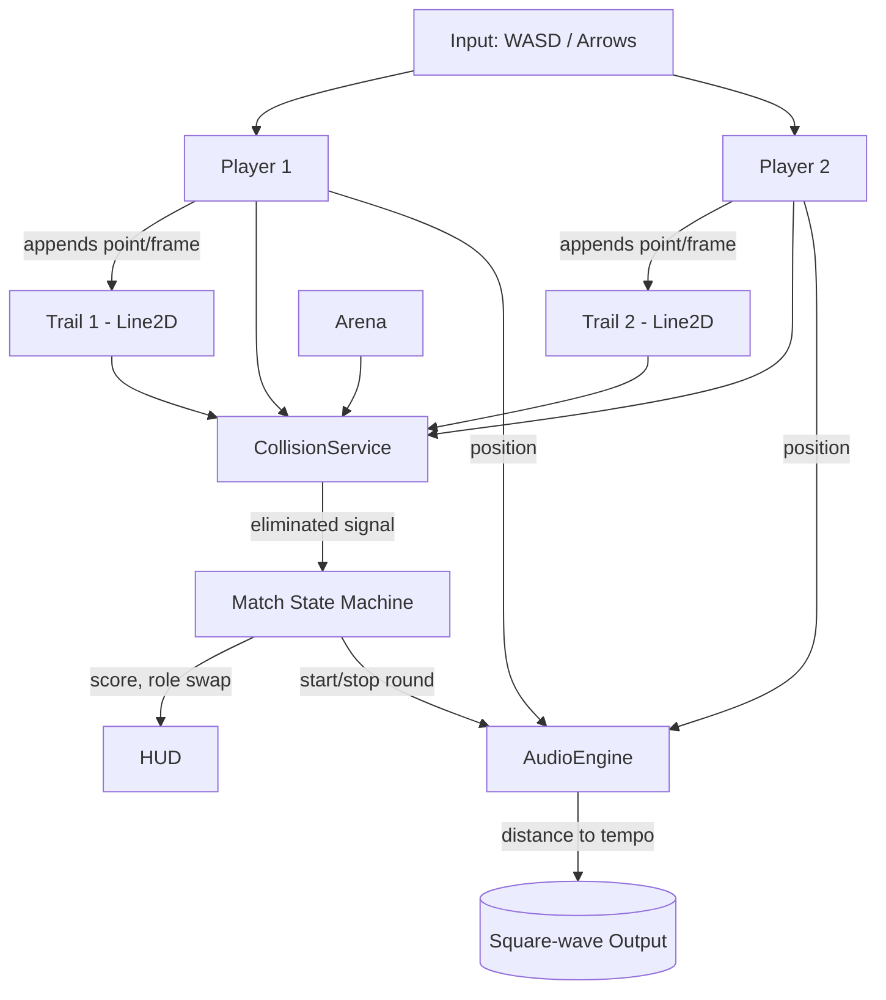

# Requirements

### Overview & Goals

Build a playable **MVP (Phase 1)** of the minimalist arcade tag game described in `SPECS.md` §2.1 — "שימור רוח ה-Atari". The MVP must prove the *Fun Factor* of the core loop before any Phase 2 work (ECS, neon shaders, Wwise/FMOD, Rollback netcode) is considered.

The core fantasy: two dots chase each other on a bounded 2D plane, each leaves a solid line trail behind it, the trails are lethal physical obstacles, and the music tempo accelerates as the dots get closer — culminating at the moment of capture.

### Scope

**In scope (MVP):**
- Single-screen, **local 2-player** match on one machine (shared keyboard or two controllers).
- One game mode: **Classic Duel** (best of 5 rounds, fading trails) per `SPECS.md` §3.3.
- Two player dots with continuous movement and line-trail generation.
- Lethal collision detection: dot vs. arena boundary, dot vs. any trail (own or opponent's), dot vs. dot (= chaser catches runner).
- Role assignment: one player is **Chaser**, one is **Runner**, swapping each round.
- **Distance-driven adaptive audio**: simple synthesised tone whose tempo/pitch is modulated in real time by the Euclidean distance between the two dots (Atari POKEY-inspired direct frequency manipulation, per `SPECS.md` §2.1).
- Minimal UI: title screen, round HUD (score, role indicator), round-end and match-end screens.

**Out of scope (deferred to Phase 2 / later):**
- Online multiplayer, Rollback netcode, lag compensation (`SPECS.md` §8).
- ECS architecture / DOTS — MVP uses straightforward OOP (`SPECS.md` §2.1).
- Custom neon fragment shader / additive blending / bloom (`SPECS.md` §4.3).
- Wwise / FMOD middleware, vertical orchestration, horizontal re-sequencing (`SPECS.md` §5.2).
- AI opponent / single-player mode (`SPECS.md` §7).
- Power-ups, additional game modes (Persistent Grid, Infection, King of the Hill).
- Mobile touch controls, haptics.

### User Stories

- As a **player at a keyboard**, I want to start a Classic Duel match with a friend in under 10 seconds so we can jump straight into playing.
- As the **Runner**, I want to see my dot move smoothly and leave a clearly visible trail so I can plan evasion routes around obstacles I have created.
- As the **Chaser**, I want the music to noticeably accelerate as I close the distance so I get a visceral sense of imminent capture.
- As a **player**, I want unambiguous round-end feedback (who won, why — caught vs. crashed) so the result feels fair.
- As a **player**, I want a best-of-5 score tracked across rounds so the match has a clear winner.

### Functional Requirements

1. **Match flow**: Title screen → match (best of 5 rounds) → match-end screen with final score → return to title.
2. **Round flow**: Countdown (3-2-1) → both dots spawn at fixed opposite positions with assigned roles → continuous play until a terminal collision → 1.5 s freeze on the final frame → score update → next round.
3. **Movement model**: Each dot moves at a constant speed. Input controls heading only (8-direction or analog turn). No braking, no acceleration in MVP — keeps the original arcade feel.
4. **Trail generation**: Every frame, each dot appends its current position to its own polyline. The polyline is drawn as a `Line2D` node.
5. **Trail behaviour (Classic Duel)**: Trails fade and disappear after a fixed lifetime (e.g. 4 s). Implementation: trim oldest points from the polyline once they exceed lifetime.
6. **Collision rules** (in priority order):
   - Dot leaves arena bounds → that dot loses the round.
   - Dot intersects any active trail segment (own or opponent's) → that dot loses the round.
   - Chaser dot intersects Runner dot → Chaser wins the round.
7. **Role swap**: After each round, Chaser and Runner roles swap so both players experience both roles.
8. **Score tracking**: First player to 3 round wins takes the match.
9. **Adaptive audio**:
   - A continuous synthesised tone (square or sawtooth wave) plays during rounds.
   - The tone's note-repeat tempo (or LFO frequency) is a monotonic function of the inverse Euclidean distance between the two dots.
   - Tempo range: e.g. ~80 BPM at max distance → ~240 BPM at minimum distance.
   - Audio fades out cleanly at round end.
10. **Input**: Player 1 = `WASD`; Player 2 = arrow keys. Optional gamepad support if Godot's `InputMap` makes it trivial.

### Non-Functional Requirements

- **Performance**: stable 60 FPS at 1920×1080 on a modern laptop. Trail polylines should never exceed ~250 points each (bounded by lifetime × frame rate × decimation).
- **Code style**: simple OOP per `SPECS.md` §2.1 — no premature optimisation, no ECS, no object pooling.
- **Visuals**: flat colours, no shaders — primary colours on a black background per `SPECS.md` §3.1 (Kinetic Readability).
- **Build target**: desktop (Windows/macOS/Linux) standalone export from Godot.
- **Accessibility**: colour-blind-safe palette for the two players (e.g. cyan vs. magenta, not red vs. green).

# Technical Design

### Current Implementation

The project is empty — only `LICENSE`, `README.md`, and `SPECS.md` exist at `/Users/tsemachhadad/dev/tofeset`. There is no Godot project, no source files, and no tooling configured. All code in this plan is greenfield.

### Key Decisions

1. **Engine: Godot 4 (GDScript)** — `SPECS.md` §4.2 and §10 explicitly recommend Godot 4 for the MVP because its built-in `Line2D` node maps directly to the trail mechanic, and §2.1 calls it out as the lightweight, intuitive option that preserves the Atari spirit. GDScript over C# to minimise build setup for the MVP.
2. **Architecture: classic OOP, scene-based** — `SPECS.md` §2.1 mandates OOP for MVP and explicitly defers ECS to Phase 2. Each major game object is a Godot scene (`Player`, `Trail`, `Arena`, `Match`).
3. **Trail = `Line2D` with rolling-buffer point list** — per `SPECS.md` §4.2, this is Godot's idiomatic approach. Append a new point every physics frame, drop the oldest once its age exceeds `trail_lifetime`. Each retained point stores `(position, spawn_time)`.
4. **Collision = analytical segment intersection, not physics bodies** — Godot's physics engine is overkill and imprecise for thousands of thin line segments at 60 FPS. Instead, implement a `CollisionService` that, per frame, tests the player's just-moved displacement segment against all active trail segments using `Geometry2D.segment_intersects_segment`. This is simple, deterministic, and matches the arcade feel.
5. **Audio = procedurally-generated tone via `AudioStreamGenerator`** — `SPECS.md` §2.1 prescribes "POKEY-inspired" direct frequency manipulation rather than middleware. Godot's `AudioStreamGenerator` with `AudioStreamGeneratorPlayback.push_buffer()` lets us write square-wave samples directly, with note period driven by player distance.
6. **Game flow = explicit state machine on the `Match` scene** — states: `Title`, `Countdown`, `Playing`, `RoundEnd`, `MatchEnd`. Simple enum + `_process` switch; no FSM library.
7. **Single-screen, fixed arena** — no camera follow, no scrolling. The whole arena fits the viewport, mirroring the Atari original.

### Proposed Changes

**Project bootstrap**
- Create a Godot 4.x project at the repo root with `project.godot`, a `main` scene, and an `assets/`, `scenes/`, `scripts/` layout.
- Configure input map: `p1_up/down/left/right` (WASD), `p2_up/down/left/right` (arrows), `ui_accept`, `ui_cancel`.
- Configure display: 1920×1080 base resolution, 2D `keep` stretch mode, black clear colour.

**Core gameplay scenes & scripts**
- `Player`: a `Node2D` with a `Sprite2D` (or just a `ColorRect`) for the dot, an attached `Trail` child node, and a script holding `velocity`, `heading`, `role` (Chaser/Runner), and a reference to its input action prefix.
- `Trail`: a `Line2D`-bearing node that owns a `PackedVector2Array` of points plus a parallel `PackedFloat32Array` of timestamps; on each physics tick it appends `global_position` and trims expired points.
- `Arena`: defines the playable rectangle and exposes `is_inside(pos: Vector2)`.
- `CollisionService` (autoload singleton): each frame, queries every player's last displacement segment against (a) arena bounds, (b) every other trail's segments, (c) every other player's position, and emits a `player_eliminated(player, cause)` signal.
- `Match`: top-level scene managing scoreboard, role assignment, round transitions, and the audio engine.
- `AudioEngine` (autoload): owns an `AudioStreamPlayer` driven by an `AudioStreamGenerator`; on each frame reads the current inter-player distance from `Match` and pushes a square-wave buffer at a tempo derived from that distance.

**UI scenes**
- `TitleScreen`: title text, "Press Start" prompt, controls hint.
- `HUD`: round score (e.g. `2 — 1`), role indicators per player, round number.
- `RoundEndOverlay`: brief panel announcing winner and cause ("Player 2 caught!", "Player 1 crashed").
- `MatchEndScreen`: final score and "Play again / Quit" options.

### Data Models / Contracts

```gdscript

# scripts/player.gd

class_name Player extends Node2D

enum Role { CHASER, RUNNER }

@export var speed: float = 220.0
@export var turn_rate: float = 4.0  # rad/sec
@export var input_prefix: String     # "p1" or "p2"
@export var color: Color

var role: Role
var heading: Vector2 = Vector2.RIGHT
var alive: bool = true
var last_position: Vector2

signal eliminated(cause: StringName)  # "out_of_bounds" | "hit_trail" | "caught"
```

```gdscript

# scripts/trail.gd

class_name Trail extends Node2D

@export var lifetime: float = 4.0
@export var width: float = 4.0
@export var color: Color

var _line: Line2D
var _times: PackedFloat32Array = []

func append_point(pos: Vector2, now: float) -> void
func trim_expired(now: float) -> void
func segments() -> Array[PackedVector2Array]  # for collision queries
```

```gdscript

# scripts/collision_service.gd  (autoload)

func check(players: Array[Player], arena: Arena) -> void

# emits player.eliminated(cause) when a terminal condition is detected

```

```gdscript

# scripts/audio_engine.gd  (autoload)

func start_round() -> void
func stop_round() -> void
func set_distance(d: float, d_min: float, d_max: float) -> void

# internally maps d -> tempo in [80, 240] BPM and pushes square-wave samples

```

```gdscript

# scripts/match.gd

enum State { TITLE, COUNTDOWN, PLAYING, ROUND_END, MATCH_END }

var state: State
var score := { "p1": 0, "p2": 0 }
var round_index: int

func _on_player_eliminated(player: Player, cause: StringName) -> void
func _start_round() -> void
func _end_round(winner: Player, cause: StringName) -> void
```

### Components

- **Player (new)** — owns its dot, heading, role, and trail; reads input from its `input_prefix`.
- **Trail (new)** — `Line2D`-backed polyline with rolling buffer; provides segment iteration for collision queries.
- **Arena (new)** — geometric bounds + visual frame.
- **CollisionService (new, autoload)** — per-frame collision checks for bounds / trail / dot-vs-dot.
- **AudioEngine (new, autoload)** — procedural square-wave generator whose tempo tracks player distance.
- **Match (new)** — state machine, scoreboard, role rotation, round/match lifecycle.
- **HUD / TitleScreen / RoundEndOverlay / MatchEndScreen (new)** — minimalist UI screens.

### File Structure

```
tofeset/
├── project.godot                      # NEW — Godot 4 project file
├── icon.svg                           # NEW — default icon
├── scenes/
│   ├── main.tscn                      # NEW — root scene, hosts Match
│   ├── match.tscn                     # NEW
│   ├── player.tscn                    # NEW
│   ├── trail.tscn                     # NEW
│   ├── arena.tscn                     # NEW
│   └── ui/
│       ├── title_screen.tscn          # NEW
│       ├── hud.tscn                   # NEW
│       ├── round_end_overlay.tscn     # NEW
│       └── match_end_screen.tscn      # NEW
├── scripts/
│   ├── match.gd                       # NEW
│   ├── player.gd                      # NEW
│   ├── trail.gd                       # NEW
│   ├── arena.gd                       # NEW
│   ├── collision_service.gd           # NEW (autoload)
│   └── audio_engine.gd                # NEW (autoload)
├── assets/
│   └── (placeholder colours/fonts; no external art for MVP)
├── README.md                          # EXISTING
├── SPECS.md                           # EXISTING
└── LICENSE                            # EXISTING
```

### Architecture Diagram



### Risks

- **Collision precision at high speed**: at 220 px/s the per-frame displacement is ~3.7 px at 60 FPS — small enough that segment-segment intersection is reliable. If speed is later increased, sub-stepping the collision check will be needed.
- **Trail segment count blow-up**: a 4 s lifetime × 60 FPS × 2 players = ~480 segments to test each frame. Brute-force O(N) is fine for MVP; spatial partitioning is a Phase 2 concern.
- **Procedural audio glitches**: `AudioStreamGenerator` requires careful buffer sizing to avoid underruns. Mitigation: pre-fill ~50 ms of samples and refill on `_process`. If glitchy, fall back to short pre-rendered tone clips with `pitch_scale` modulation (acceptable per `SPECS.md` §2.1).
- **Input fairness on shared keyboard**: cheap keyboards have limited key-rollover. Document the WASD/arrow split as the recommended layout; both 4-key sets are usually rollover-safe.

# Testing

### Validation Approach

The MVP is small enough that the primary validation is **manual playtesting** of the core loop, complemented by a handful of headless GDScript unit tests for the pure-logic pieces (collision math, distance→tempo mapping, score state machine). Godot 4's built-in `GdUnit` or a minimal hand-rolled test runner is sufficient — no external test framework is mandatory for MVP.

### Key Scenarios

1. **Cold start to first round**: launch the game → press Start on the title screen → countdown plays → both dots spawn at opposite ends with correct role colours → controls respond immediately.
2. **Trail rendering**: each dot leaves a visible `Line2D` trail; trail age-out visibly trims the oldest segment after ~4 s.
3. **Catch win**: drive the Chaser dot directly into the Runner dot → round ends, Chaser score increments, overlay shows "Caught!".
4. **Boundary loss**: drive a dot into the arena edge → that dot loses the round regardless of role.
5. **Trail-crash loss**: drive a dot into its own or the opponent's trail → that dot loses the round.
6. **Role swap**: after each round, the Chaser/Runner colour and HUD indicator swap.
7. **Match end**: first to 3 round wins triggers the match-end screen with final score.
8. **Adaptive audio**: starting far apart, the tone repeats slowly; deliberately closing the distance audibly accelerates the tempo; tempo peaks just before capture; audio cleanly stops at round end.

### Edge Cases

- Both dots cross-collide on the same frame (head-on contact) → resolve as Chaser-wins (Chaser had priority); verify no double-elimination crash.
- A dot hits its own freshly-spawned trail point in the first frame → ignore the most recent N points from self-collision (small grace window) to prevent instant self-loss at spawn.
- Player presses opposite directions simultaneously → heading update should be deterministic (last-input-wins or net-vector); document and test.
- Window loses focus mid-round → audio should pause cleanly; no buffer-underrun crash.
- Long matches (max 9 rounds) → no memory growth from leaked `Line2D` nodes; verify trails are freed at round end.

### Test Changes

- Add `tests/test_collision.gd` covering:
  - segment vs. segment intersection (hit, miss, collinear, endpoint-touch).
  - point inside / outside arena rectangle.
- Add `tests/test_audio_mapping.gd` covering the `distance → BPM` curve at min, max, and midpoint.
- Add `tests/test_match_state.gd` covering score increments, role swap on round transition, and match-end at 3 wins.
- Manual playtest checklist tracked in `docs/MVP_PLAYTEST.md` (created as part of the final stage).

# Delivery Steps

### ✓ Step 1: Bootstrap Godot 4 project and arena scaffolding
A Godot 4 project opens, runs, and shows an empty bounded arena rendered against a black background.

- Create `project.godot` at the repo root configured for Godot 4.x, 1920×1080 base resolution, 2D `keep` stretch mode, black clear colour.
- Add `icon.svg` placeholder.
- Configure `InputMap` with `p1_up/down/left/right` (WASD), `p2_up/down/left/right` (arrow keys), `ui_accept`, `ui_cancel`.
- Create `scenes/main.tscn` as the root scene and wire it as the project's main scene.
- Create `scenes/arena.tscn` + `scripts/arena.gd` defining the playable rectangle and a visual frame; expose `is_inside(pos: Vector2) -> bool`.
- Verify the project launches via Godot CLI/GUI and renders the arena.

### ✓ Step 2: Implement Player movement and Line2D trail generation
Both player dots move on input and leave visible fading line trails; no collisions or scoring yet.

- Create `scenes/player.tscn` + `scripts/player.gd` with `speed`, `heading`, `role`, `input_prefix`, `color`, and per-frame movement updating `global_position`.
- Bind `p1_*` actions to Player 1 and `p2_*` actions to Player 2 in `main.tscn`; spawn both at opposite ends of the arena.
- Create `scenes/trail.tscn` + `scripts/trail.gd` wrapping a `Line2D` plus a `PackedFloat32Array` of timestamps; append the player's `global_position` each physics frame and trim points older than `lifetime` (default 4 s).
- Use distinct colour-blind-safe colours per player (cyan / magenta) for both the dot and its trail.
- Manually verify smooth movement at 60 FPS and visible trail aging.

### ✓ Step 3: Implement collision detection and round termination
Rounds end correctly on out-of-bounds, trail crash, and catch, emitting a clear cause.

- Create `scripts/collision_service.gd` as an autoload singleton.
- Each physics frame: for every alive player, build the displacement segment `(last_position, current_position)` and test against (a) arena bounds via `Arena.is_inside`, (b) every other trail's segments via `Geometry2D.segment_intersects_segment`, (c) every other player's dot position with a small radius.
- Apply a small grace window that ignores the player's N most recent self-trail points to prevent instant self-collision at spawn.
- Emit `player.eliminated(cause)` with `cause ∈ {out_of_bounds, hit_trail, caught}` and freeze movement on elimination.
- Add `tests/test_collision.gd` covering segment-segment intersection (hit, miss, endpoint-touch) and arena-bounds checks.

### ✓ Step 4: Implement Match state machine, scoring, and HUD
Players can play a full Classic Duel match (best of 5) with role swapping, score tracking, and clear round/match-end feedback.

- Create `scenes/match.tscn` + `scripts/match.gd` with a `State` enum (`TITLE`, `COUNTDOWN`, `PLAYING`, `ROUND_END`, `MATCH_END`).
- Implement round lifecycle: countdown 3-2-1 → spawn players with assigned Chaser/Runner roles → run round → on `eliminated` signal, freeze 1.5 s, increment score, swap roles, advance to next round or match end.
- Resolve the head-on tie case as Chaser-wins.
- Create `scenes/ui/hud.tscn` showing round number, per-player score, and role badge.
- Create `scenes/ui/title_screen.tscn`, `scenes/ui/round_end_overlay.tscn` (winner + cause text), and `scenes/ui/match_end_screen.tscn` (final score + Play again / Quit).
- Add `tests/test_match_state.gd` covering score increments, role swap on round transition, and match end at 3 wins.

### ✓ Step 5: Implement distance-driven adaptive audio engine
A continuous synthesised tone plays during rounds and audibly accelerates as the dots get closer, peaking at capture.

- Create `scripts/audio_engine.gd` as an autoload singleton owning an `AudioStreamPlayer` backed by `AudioStreamGenerator` (mix rate ~22050 Hz, ~50 ms buffer).
- Implement `start_round()`, `stop_round()`, and `set_distance(d, d_min, d_max)`; map distance monotonically to a tempo in `[80, 240]` BPM (linear or inverse-distance curve).
- In `_process`, refill the generator buffer with a square-wave whose note repeat period is derived from the current tempo; ensure clean fade-out on `stop_round`.
- Wire `Match` to call `AudioEngine.start_round()` / `stop_round()` and to push the inter-player distance every frame during `PLAYING`.
- Add `tests/test_audio_mapping.gd` covering the `distance → BPM` curve at min, max, and midpoint.
- Document the manual playtest checklist (controls, win conditions, audio behaviour, edge cases) in `docs/MVP_PLAYTEST.md`.